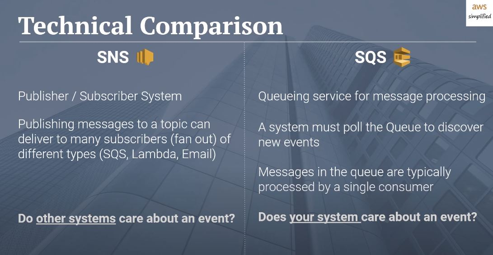
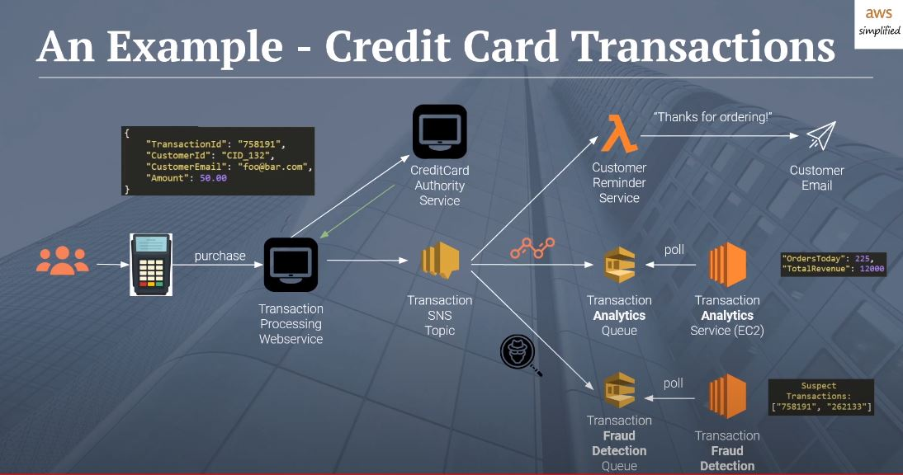

# **Event Driven Architecture**

### **Let's 1st answer the questions**

* **What’s the difference between a FIFO and a standard queue?**

   * Standard queues guarantee that a message is delivered at least once and duplicates can be introduced into the queue. 
   * FIFO queues ensure a message is delivered exactly once and remains available until a consumer processes and deletes it; duplicates are not introduced into the queue.

* **How can the server be assured a message was properly received?**

  * By sending or emiting an event with the message that the message recieved .

* **What classic design pattern is best represented by event driven programming?**

   * The observer pattern is a software design pattern in which an object, named the subject, maintains a list of its dependents, called observers, and notifies them automatically of any state changes, usually by calling one of their methods.

* **How do you test an event driven system?**
 
  * by emitting an event 

### **Vocabulary Term**

* **FIFO Queue :**
*a queue works based on the first-in, first-out (FIFO) principle.The enqueue operation inserts an element at the end of the queue, whereas the dequeue operation removes an element from the front of a queue*

* **Pub/Sub :**
*is an asynchronous messaging service that decouples services that produce events from services*

### **Difference between SNS & SQS**

### **Example :**

***
***
***
[BACK TO MAIN PAGE](https://github.com/farahalwahaibi/Reading-Notes/blob/main/README.md)
