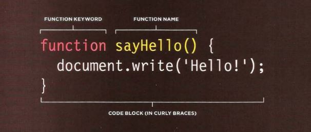
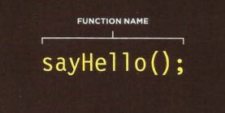
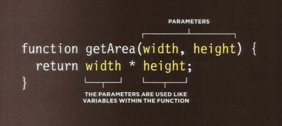
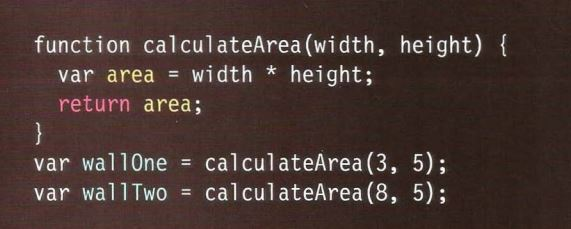

# **JavaScript & jQuery**
# **FUNCTIONS :**
### - **WHAT IS A FUNCTION?**
**Functions let you group a series of statements together to perform a specific task. If different parts of a script repeat the same task, you can reuse the function (rather than repeating the same set of statements).**

-**Basic Example** :

   

***
 * **DECLARING A FUNCTION :**

   

 * **CALLING A FUNCTION :**

   
 
 * **DECLARING  FUNCTIONS THAT NEED INFORMATION:**

    

 * **CALLING FUNCTIONS THAT NEED INFORMATION**

 * **GETTING A SINGLE VALUE OUT OF A FUNCTION**

    

*** 
***
***
[BACK TO MAIN PAGE](https://github.com/farahalwahaibi/Reading-Notes/blob/main/README.md)