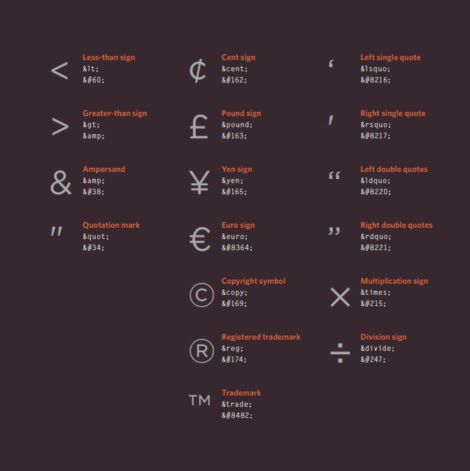
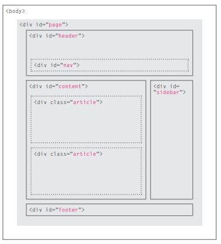
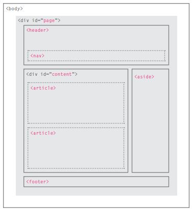

# Chapter 1 - Structure

## **HTML pages are text documents**

## The structure of the HTML :
HTML uses tags (characters that sit inside angled brackets) to give the information they surround special meaning, and it contains:

* `<body>` : Everything inside this element is
shown inside the main browser window.

* `<head>` : This contains information about the page (rather than information that is shown within the main part of the browser window that is highlighted in blue on the opposite page). 

* `<title>` : The contents of the title element are either shown in the top of the browse .

### **Tag is often referred to as element and it come with :**

* Opening tags :(denotes the start, can carry attributes, which tell us more about the content of that element.)
    * (Attributes require a name and a value)
* Closing tags :(denotes the end) 

# Chapter 8 - Extra Markup

1. Specifying different versions of HTML

2. Identifying and grouping elements

3. Comments, meta information and iframes
***
## THREE DIFFERENT VERSIONS OF HTML :
 1. HTML 4
 2. XHTML 1.0
 3. HTML 5
***
## ELEMENTS IN HTML :
 * meta : for contains information about your page .
 * iframe :  is like a little window that has been cut into your page — and in that window you can see another page.
 * span : to  control the appearance of the content of these elements using CSS.
 * div : allows you to group a set of elements together in one block-level box.
 * <!-- --> : to add comment .
***
## **Escape Characters :**
  
***
# SO IT SEEMS THAT :
 * DOCTYPES tell browsers which version of HTML you are using.
 * You can add comments to your code between the <!-- and --> markers.
 * The id and class attributes allow you to identify particular elements.
 * The div and span elements allow you to group block-level and inline elements together.
 * frames cut windows into your web pages through which other pages can be displayed.
 * The meta tag allows you to supply all kinds of information about your web page.
 * Escape characters are used to include special characters in your pages such as <, >, and ©.
 
 ***
 ***
 ***
# Chapter 17 - HTML5 Layout

1. HTML5 layout elements

2. How old browsers understand new elements

3. Styling HTML5 layout elements with CSS

***

## - OLD ELEMENTS VS NEW ELEMENTS :

 *  Traditional HTML Layouts 

 

 * New Html5 Layout Elements

  

***
## - HTML5 LAYOUT ELEMENTS :
  ### 1. **Headers & Footers:**
   * The main header or footer that appears at the top or bottom of every page on the site.
   * A header or footer for an individual article or section within the page.
 ### 2. **Navigation:**
  * The nav element is used to contain the major navigational blocks on the site such as the primary site navigation.
 ### 3. **Articles:**
  * The article element acts as a container for any section of a page that could stand alone and potentially be syndicated.
 ### 4. **Asides:**
  * The aside element has two purposes, depending on whether it is inside an article element or not.
 ### 5. **Sections:**
  * The section element groups related content together, and typically each section would have its own heading.
 ### 6. **Heading Groups:**
  * The purpose of the hgroup element is to group together a set of one or more h1 through h6 elements so that they are treated as one single heading.
 ### 7. **Figures:**
  * You already met the figure element in Chapter 5 when we looked at images. It can be used to contain any content that is referenced from the main flow of an article (not just images).
  * It is important to note that the article should still make sense if the content of the figure element were moved (to another part of the page, or even to a different page altogether).
  * For this reason, it should only be used when the content simply references the element (and not for something that is absolutely integral to the flow of a page).
  * Examples of usage include: (Images, videos, graphs, diagrams, code samples, and Text that supports the main body of an article)
 ### 8. **Sectioning elements:**
  * It may seem strange to follow these new elements by revisiting the div element again. (After all, the new elements are often going to be used in its place.)
 * However, the div element will remain an important way to group together related elements, because you should not be using these new elements that you have just met for purposes other than those explicitly stated.
 * Where there is no suitable element to group a set of elements, the div element will still be used.
 ### 9. **Linking around block-level elements:**
  * HTML5 allows web page authors to place an a element around a block level element that contains child elements. This allows you to turn an entire block into a link.
 ### 10. **Helping older browser understand:**
  * Older browsers that do not know the new HTML5 elements will automatically treat them as inline elements. Therefore, to help older browsers, you should include the line of CSS on the left which states which new elements should be rendered as block-level elements.
  ***
  ## SO IT SEEMS THAT :
  1. The new HTML5 elements indicate the purpose of different parts of a web page and help to describe its structure.
  2. The new elements provide clearer code (compared with using multiple div elements).
  3. Older browsers that do not understand HTML5 elements need to be told which elements are block-level elements.
  4. To make HTML5 elements work in Internet Explorer 8 (and older versions of IE), extra JavaScript is needed, which is available free from Google.
  ***
  ***
  ***
# Chapter 18 - Process & Design 

1. How to approach building a site

2. Understanding your audience and their needs

3. How to present information visitors want to see

**This section discusses a process that you can use when you are creating a new website.**

* How to understand the audience your site may attract and what information they will expect to find on it
* How to organize information so that visitors can find what they are looking for
* Design theory for presenting information in a way that helps visitors achieve their goals
* Design tips to help you create more attractive and
professional sites 

***
## **Who will visit your website and know what the information the visitors need to show it in the site, we should create a design that attract the visitor.**

### Target Audience: individuals 
 * What is the age range of your target audience?
 * Will your site appeal to more women or men? What is the mix?
 * Which country do your visitors live in?
 * Do they live in urban or rural areas?
 * What is the average income of visitors?
 * What level of education do they have?
 * What is their marital or family status?
 * What is their occupation?
 * How many hours do they work per week?
 * How often do they use the web?
 * What kind of device do they use to access the we

### Target Audience: Companies 
 * What is the size of the company or relevant department?
 * What is the position of people in the company who visit your site?
 * Will visitors be using the site for themselves or for someone else?
 * How large is the budget they control?

***
## **Why people visit your website?**
 1. Try to discover **motivations** for why people come to your site.
 2. Examines the specific **goals** of the visitors.

***
# SO IT SEEMS THAT :
 * It's important to understand who your target audience is, why they would come to your site, what information they want to find and when they are likely to return.
 * Site maps allow you to plan the structure of a site.
 * Wire frames allow you to organize the information that will need to go on each page.
 * Design is about communication. Visual hierarchy helps visitors understand what you are trying to tell them.
 * You can differentiate between pieces of information using size, color, and style. 
 * You can use grouping and similarity to help simplify the information you present.
***
***
***
[BACK TO MAIN PAGE](https://github.com/farahalwahaibi/Reading-Notes/blob/main/README.md)