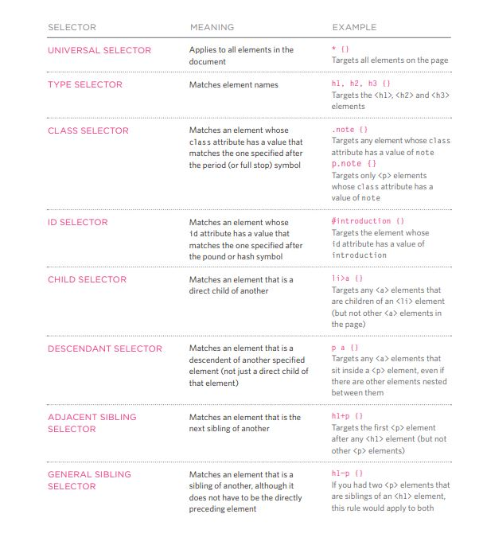
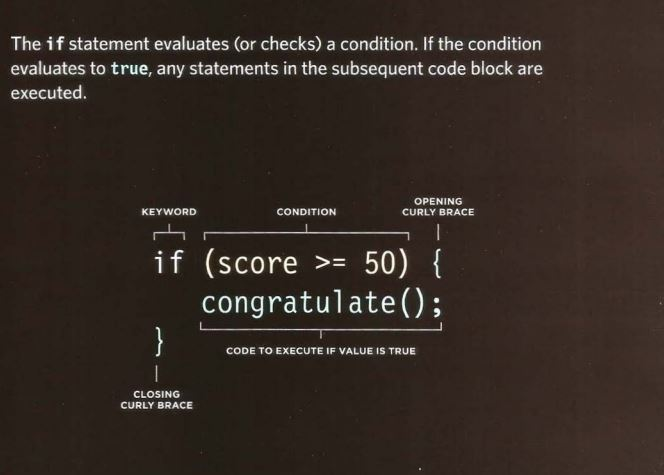
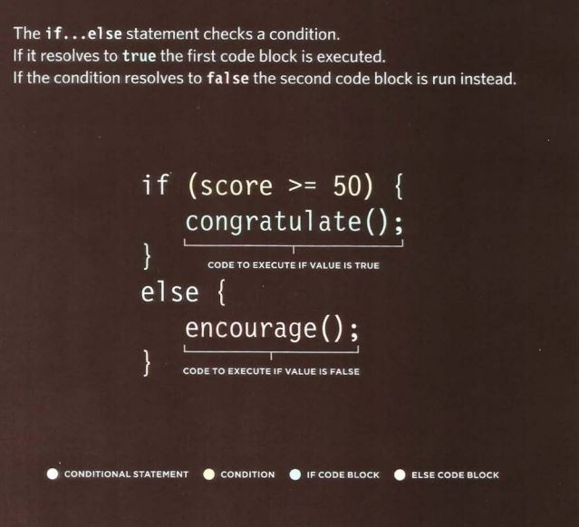

# **CH.2 TEXT** 
***
## The HTML which is resposible about the content of the web pages , contains :
 * TEXT
 * IMAGES
 * LINKS 

## For the text content we have :
1. **Structure markup** "it uses for the way that your text looks"
2. **Semantic markup** "it describes the content of your web pages more accurately, So it's not affect web pages it's adding extra information and often we use it for other programs such as : 
   * **Screen reader** 
   * **Engines**
***
## Structure Markup Tag or Elements :
 Tag |  Shourtcut
----|----
Headings | < h1 ></ h1 > or < h2 ></ h2 > until h6
Paragraph | < p ></ p >
Bold | < b ></ b >
Italic | < i ></ i >
Superscript | < sup ></ sup >
Subscript | < sub ></ sub >
Break line | < br />

***
## Semantic Markup Tag or Elements :

Tag | shourtcut
----|----
Strong | < strong ></ strong > tells the browser about the importance of paragraphs, for it's result it's same as bold 
Emphasis| < em > </ em > it will change the meaning of sentense 
Qotation | < q ></ q > the value for it should be URL for the cite source
cite | < cite ></ cite > refer to piece of work : book, film research paper
difine | < dfn ></ dfn > first time to explain new terminology 
insert | < ins ></ ins > show content that has been inserted into document 
delete | < del ></ del > showing something that no longer accurate but shouldn't be deleted 
address | < address ></ address > contains contact details but not physical such as email, phone number and links 
hCard | for physical address
***

## **SO** :
- ### **HTML element used to describe the structure of the web page**
- ### **Sometimes we have to use semantic markup for adding more accurate information for screen reader & engine users**
***
***
***

# **CH.10 INTRODUCING CSS**
***
## **CSS allows you to create rules that control the way that each individual box (and the contents of that box) is presented.**

### **Example Styles** :
1. **Boxes** :
    * Width and height Borders (color, width, and style)
    * Background color and images
    * Position in the browser window.
2. **Text** :
    * Typeface
    * Size
    * Color
    * Italics, bold, uppercase,
    * lowercase, small-caps
3. **Specific** :
    * There are also specific ways in which you can style certain elements such as lists, tables, and forms.
***
## **Now let's talk about CSS Associates Style rules with HTML elements** :
1. **Selectors** : indicate which element the rule applies to. The same rule can apply to more than one element if you separate the element names with commas.
2. **Declarations** : indicate how the elements referred to in the selector should be styled. Declarations are split into two parts separated by a colon : 
    * **property** :  indicate the aspects of the element you want to change. For example, color, font, width, height and border
    * **value** : s specify the settings you want to use for the chosen properties. For example, if you want to specify a color property then the value is the color you want the text in these elements to be.
***
## **Now lets talk about the way that we can connect the HTML with the CSS :**

1. ###  **External CSS** : by the **< link >** element (it can be used in an HTML document to tell the browser where to find the CSS file used to style the page.) and it has been done by the following :
   * **href** :this specifies the path to the CSS file (which is often placed in a folder called css or styles).
   * **type** :this attribute specifies the type of document being linked to. The value should be text/css.
   * **rel** :this specifies the relationship between the HTML page and the file it is linked to. The value should be stylesheet when linking to a CSS file.

2. ###  **Internal CSS** : by the **< style >** element (You can also include CSS rules within an HTML page by placing them inside a < style > element, which usually sits inside the < head > element of the page)
3. ### **CSS Selectors** : There are many different types of CSS selector that allow you to target rules to specific elements in an HTML document.

***
## **CSS Selectors types** : 

***

## **FINALLY** :
 * CSS treats each HTML element as if it appears inside its own box and uses rules to indicate how that element should look.
* Rules are made up of selectors (that specify the elements the rule applies to) and declarations (that indicate what these elements should look like).
* Different types of selectors allow you to target your rules at different elements.
* Declarations are made up of two parts: the properties of the element that you want to change, and the values of those properties. For example, the font-family property sets the choice of font, and the value arial specifies Arial as the preferred typeface.
* CSS rules usually appear in a separate document, although they may appear within an HTML page.

***
***
***
# **CH.2 Basic JavaScript Instructions** 
***
## **STATEMENTS** : A script is a series of instructions that a computer can follow one-by-one. Each individual instruction or step is known as a statement. Statements should end with a semicolon.

## **COMMENTS** : You should write comments to explain what your code does. They help make your code easier to read and understand.This can help you and others who read your code.
***

## **WHAT IS A VARIABLE?** 
**A script will have to temporarily store the bits of information it needs to do its job. It can store this data in variables.**
### **How to declare variabls ?**

### **How to assign them a value ?**

***
***
## The data types for variabls :**
 1. **NUMERIC** : for number
 2. **STRING** : for letters and other characters
 3. **BOOLEAN** : true or false 
 ***
 ### **RULES FOR NAMING VARIABLES :**
 1. The name must begin with a letter, dollar sign ($),or an underscore (_). It must not start with a number. 
 2. The name can contain letters, numbers, dollar sign ($), or an underscore (_). Note that you must not use a dash(-) or a period (.) in a variable name.
 3. You cannot use keywords or reserved words. Keywords are special words that tell the interpreter to do something. For example, var is a keyword used to declare a variable. Reserved words are ones that may be used in a future version of JavaScript. 
 4. All variables are case sensitive, so score and Score would be different variable names, but it is bad practice to create two variables that have the same name using different cases. 
 5. Use a name that describes the kind of information that the variable stores. For example, fi rstName might be used to store a person's first name, lastNarne for their last name, and age for their age. 
 6. If your variable name is made up of more than one word, use a capital letter for the first letter of every word after the first word. For example, f i rstName rather than firstnarne (this is referred to as camel case). You can also use an underscore between each word (you cannot use a dash).
 ***
### **What is the array ?**
**An array is a special type of variable. It doesn't just store one value; it stores a list of values.**
### **What is expression ?**
**An expression evaluates into (results in) a single value Broadly speaking there are two types of expressions.**
### **What is OPERATOR ?**
**Expressions rely on things called operators; they allow programmers to create a single value from one or more values.**
***
### **ARITHMETIC OPERATORS** 

***
## **FINALY :**
* A script is made up of a series of statements. Each statement is like a step in a recipe.
* Scripts contain very precise instructions. For example, you might specify that a value must be remembered before creating a calculation using that value.
* Variables are used to temporarily store pieces of information used in the script.
* Arrays are special types of variables that store more than one piece of related information.
* JavaScript distinguishes between numbers (0-9), strings (text), and Boolean values (true or false).
* Expressions evaluate into a single value.
* Expressions rely on operators to calculate a value. 
***
***
***
# **CH.4 Decisions and Loops**
***
**COMPARISON OPERATORS**
### we can evaluate a situation by comparing one value in the script to what you expect it might be, So the result will be a Boolean : 
* True 
* False

***
## COMPARISON OPERATORS SYMBOLES : 
1. **==** "EQUAL TO" compares 2 values if they are the same.
2. **!=** "NOT EQUAL TO" compares 2 values if they are **not** the same .
3. **===** "STRICT EQUAL TO" compares 2 values to check that the both data type and value are the same.
4. **!==** "STRICT NOT EQUAL TO" compares 2 values to check that the both data type and value are **not** the same.
5. **>** "GREATER THAN" checks if the number on the left is greater than the number on the right.
6. **<** "LESS THAN" checks if the number on the left is less than the number on the right.
7. **>=** "GREATER THAN **OR** EQUAL TO" checks if the number on the left is greater or equal to the number on the right.
8. **<=** "LESS THAN **OR** EQUAL TO" checks if the number on the left is less or equal to the number on the right.

***
## LOGICAL OPERATORS :
**AND &&**  | **MUST both expressions evaluate true to returns true ,otherwise return fales**
--- | ---
**OR**  **II**  | **MUST both expressions evaluate false to returns false ,otherwise return true** 
**NOT !** | **If the statement was true, it would return false and If the statement was false, it would return true**

***
# **LOOPS**
### Loops check a condition, If it returns true, a code block will run.Then the condition will be checked again and If it still return true, the code block will run again. It repeats until the condition return ## **FALSE** .
***
## **IF STATEMENTS** 

## **IF ELSE STATEMENTS**

***
***
***
[BACK TO MAIN PAGE](https://github.com/farahalwahaibi/Reading-Notes/blob/main/README.md)