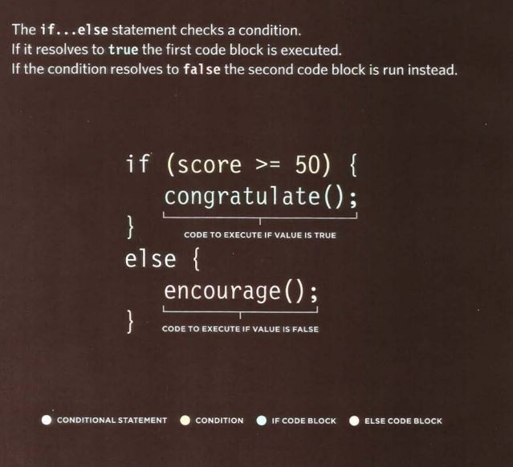

# **CH.3: Lists**
***
## **HTML provides us with three different types of lists:**
* **Unordered lists** are lists that begin with a **bullet** point `<ul>`.
1. **Ordered lists** are lists where each item in the list is **numbered** `<ol>`.
 * **Definition lists** are made up of a set of terms along with the **definitions** for each of those terms `<dl>` 
    * `<dt>` : This is used to contain the term being defined (the definition term).
    * `<dd>` : This is used to contain the definition.

 
### And finally **Lists can be nested inside one another**.
***
***
***
# **CH.13: Boxes** 
## Boxes proporeties :
1. Border : The border separates the edge of one box from another.
2. Margin : Margins sit outside the edge of the border.
3. Padding : is the space between the border of a box and any content contained within it.
***
## which tags has affected Boxes :
*  Box {**width, height**} dimensions.
*  description {**min-width, max-width**} .
*  **{min-height, max-height}** .
*  overflow : **{hidden , scroll}** .
*  **{border-width, border-color, border-style}**
*  **{padding-top,padding-right,padding-left, padding-bottom}** 
*  **{margin-top,margin-right,margin-left,margin-bottom}**
*  **{text-align:left, right, center, top, bottom}**
*  **{inline}** This causes a block-level element to act like an inline element
*  **{block}** This causes an inline element to act like a block-level element.
*  **{inline-block}**This causes a block-level element to flow like an inline element, while retaining other features of a block-level element.
*  **{none}** this hidden an element .
*  **{visibility:hidden, visible}**
*  **{border-image: strech, repeat, around}**
*  **{box-shadow: horizontal offset, vertical offeset, blur distance, spread of shadow}**
*  **{border-radius}**
***
## SO :
1. It is possible to hide elements using the display and visibility properties
2. Block-level boxes can be made into inline boxes, and
inline boxes made into block-level boxes.
3. Legibility can be improved by controlling the width of
boxes containing text and the leading.
4. CSS3 has introduced the ability to create image
borders and rounded borders.
***
***
***
# **CH.2: Basic JavaScript Instructions**
## **ARRAYS** :
**Is a special type of variable. It doesn't just store one value; it stores a list of values**  
### EX. :
1.  
   *      var colors;
          colors= ['white', 'black', ' custom']; 
2. 
   *      var colors= new Array('white ' ,
                                'black',
                                'custom'); 
## **VALUES IN ARRAYS** :
**Values in an array are accessed as if they are in a numbered list. It is important to know that the numbering of this list starts at zero (not one).**
   *      INDEX     VALUE
           0       'white'
           1       'black'
           2       'custom' 

## **ACCESSING & CHANGING VALUES IN AN ARRAY** :
*     // Create the array
      var colors = ['white', 
                    'black' ,
                    'custom']; 

      // Update the third item in the array  
      colors[2] = 'beige ' ;    

      // Get the element with an id of colors 
      var el = document .getElementByid(' colors') ;

      // Replace with third item from the array  
      el .textContent = colors[2]; 
             
***
***
***
# **CH.4: Decisions and Loops**
## **IF STATEMENTS** 

## **IF ELSE STATEMENTS**

## **SWITCH STATEMENTS**
A switch statement starts with a variable called the switch value. Each case indicates a possible value for this variable and the code that should run if the variable matches that value. 
## **IF ELSE VS IF SWITCH :**
1. **IF ELSE**
   * There is no need to provide an else option. (You can just use an if statement.)
   * With a series of if statements, they are all checked even if a match has been found (so it performs more slowly than switch).
2. **SWITCH**
   * You have a default option that is run if none of the cases match.
   * If a match is found, that code is run; then the break statement stops the rest of the switch statement running (providing better performance than multiple if statements). 

## **LOOPS :**
### Loops check a condition, If it returns true, a code block will run.Then the condition will be checked again and If it still return true, the code block will run again. It repeats until the condition return ## **FALSE** .
***
## **KEY LOOP CONCEPTS :**
1. **break** This keyword causes the termination of the loop and tells the interpreter to go onto the next statement of code outside of the loop. (You may also see it used in functions.) 
2. **continue** This keyword tells the interpreter to continue with the current iteration, and then check the condition again. (If it is true, the code runs again.) 

## **TYPE OF LOOPS :**
1. **FOR LOOP** : is often used to loop through the items in an array, also using for count numbers.
2. **WHILE LOOP** : usualy using for string count. 
3. **USI NG DO WHILE LOOPS** : The key difference between a whi1e loop and a do while loop is that the statements in the code block come before the condition. This means that those statements are run once whether or not the condition is met. 
***

## **SO :**
* if ... else statements allow you to run one set of code
if a condition is true, and another if it is false. 
* switch statements allow you to compare a value against possible outcomes (and also provides a default option if none match). 
* Data types can be coerced from one type to another. 
* All values evaluate to either truthy or falsy. 
* There are three types of loop: for, while, and do ... while. Each repeats a set of statements. 

***
***
***
[BACK TO MAIN PAGE](https://github.com/farahalwahaibi/Reading-Notes/blob/main/README.md)

