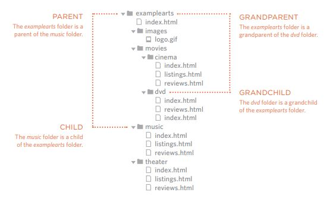
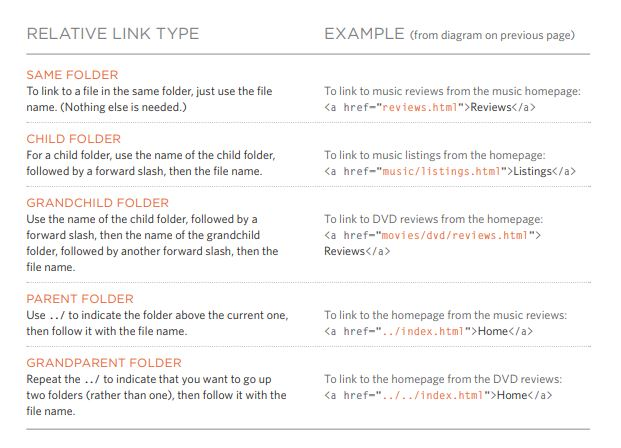
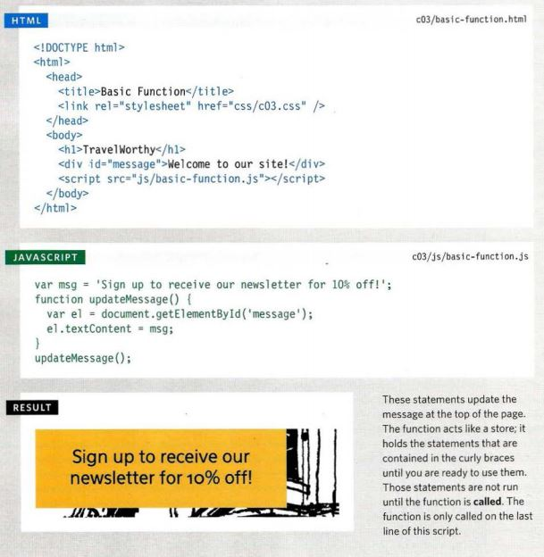
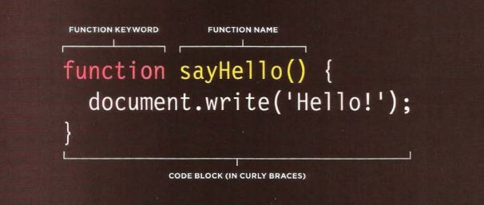
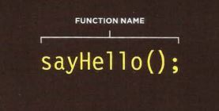
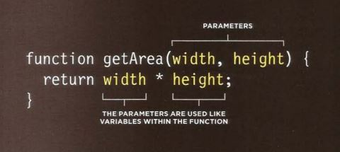
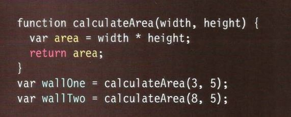
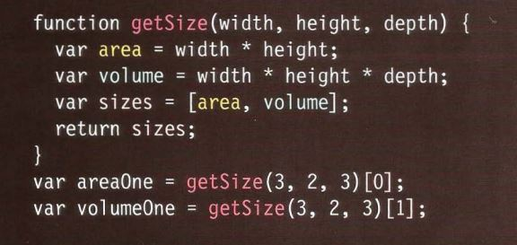

# **CH.4 : LINK**
## **Three tyres of link:**
* Creating links between pages (see relative link below)

* Linking to other sites <a href="site">text</a>

* Email links <a href="main email@example.com">Email text</a>

***
## **Relative link types :**
**Explanation for relative folder structure:**

**Relative URLs can be used when linking to pages within your own website.**

***
## **SO :**
* Links are created using the <a> element.
* The <a> element uses the href attribute to indicate the page you are linking to.
* If you are linking to a page within your own site, it is best to use relative links rather than qualified URLs.
* You can create links to open email programs with an email address in the "to" field.
* You can use the id attribute to target elements within a page that can be linked to.
***
***
***
# **CH.15 : LAYOUT** 
(we will focus on pages 358-364)
## **Key Concepts in Positioning Elements** :
### **Building block** 
CSS treats each HTML element as if it is in its own box. This box will either be a block-level box or an inline box.
* Block-level elements start on a new line
Ex.:
`<h1> 
 <ul> <li>`
* Inline elements flow in between surrounding text
Ex.:
` <b> <i>`

### **What is Containing Elements** :
If one block-level element sits inside another block-level element then the outer box is containing element or inside element .

### **How Controlling the Position of Elements** :
**CSS has the following positioning schemes that allow you to control the layout of a page: normal flow, relative positioning, and absolute positioning.**

* **Normal flow** Every block-level element appears on a new line, causing each item to appear lower down the page than the previous one.

* **Relative Positioning**  This moves an element from the
position it would be in normal flow, shifting it to the top, right, bottom, or left of where it would have been placed. 

* **Absolute positioning** This positions the element in relation to its containing element. It is taken out of normal flow, meaning that it does not affect the position of any surrounding elements (as they simply ignore the space it would have taken up.

* **Fixed Positioning** This is a form of absolute positioning that positions the element in relation to the browser window, as opposed to the containing element. 

* **Floating Elements** Floating an element allows you to take that element out of normal flow and position it to the far left or right of a containing box. 

***
***
***
# **CH.3 : Functions, Methods, and Objects**
# **FUNCTIONS :**
### - **WHAT IS A FUNCTION?**
**Functions let you group a series of statements together to perform a specific task. If different parts of a script repeat the same task, you can reuse the function (rather than repeating the same set of statements).**

-**Basic Example** :

   

***
 * **DECLARING A FUNCTION :**

   

 * **CALLING A FUNCTION :**

   
 
 * **DECLARING  FUNCTIONS THAT NEED INFORMATION:**

    

 * **CALLING FUNCTIONS THAT NEED INFORMATION**

 * **GETTING A SINGLE VALUE OUT OF A FUNCTION**

    

*  **GETTING MULTIPLE VALUES OUT OF A FUNCTION**

     

## **VARIABLES SCOPE :**
**Is the location where you declare a variable will affect where it can be used within your code. If you declare it within a function, it can only be used within that function.**
## **TYPES OF SCOPE :**
1. **LOCAL VARIABLES** : When a variable is created inside a function using the var keyword, it can only be used in that function.
2. **GLOBAL VARIABLES** :  If you create a variable outside of a function, then it can be used anywhere within the script.

***
***
***

# **6 Reasons for Pair Programming** :
## **What is pair programming ?**

**pair programming is the practice of two developers sharing a single workstation to interactively tackle a coding task together**

## **How does pair programming work?**

* **The Driver** who is the programmer who is typing and the only one whose hands are on the keyboard. 

* **The Navigator** uses their words to guide the Driver but does not provide any direct input to the computer. 

## **Why pair program?**

1. **Greater efficiency** :pair programing takes slightly longer, but produces higher-quality code that doesn’t require later effort in troubleshooting and debugging (let alone exposing users to a broken product).

2. **Engaged collaboration** : When two programmers focus on the same code, the experience is more engaging and both programmers are more focused than if they were working alone.

3. **Learning from fellow students** :  Often times, the developers in a pairing have different skill sets. If one programmer is more experienced in a certain skill, they can teach a student who is less familiar with that area. 

4. **Social skills** :Pair programming not only improves programming skills, but can also help programmers develop their interpersonal skills.

5. **Job interview readiness** : For most roles, the ability to work with and learn from others and stellar communication skills are as (or more!) important to a company than specific technical skills. Pair programming strengthens all of those skills.

6. **Work environment readiness** : Code Fellows graduates who are already familiar with how pairing works can hit the ground running at a new job, with one less hurdle to overcome.

# **Ready to dive in and improve your pair programming and your coding skills?**

***
***
***
[BACK TO MAIN PAGE](https://github.com/farahalwahaibi/Reading-Notes/blob/main/README.md)

