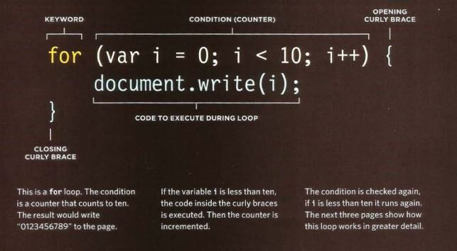
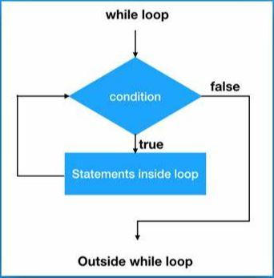
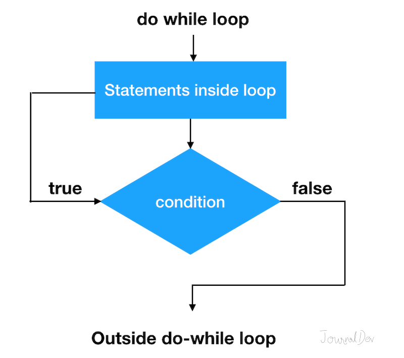

# **COMPARISON OPERATORS**
### we can evaluate a situation by comparing one value in the script to what you expect it might be, So the result will be a Boolean : 
* True 
* False

***
## COMPARISON OPERATORS SYMBOLES : 
1. **==** "EQUAL TO" compares 2 values if they are the same.
2. **!=** "NOT EQUAL TO" compares 2 values if they are **not** the same .
3. **===** "STRICT EQUAL TO" compares 2 values to check that the both data type and value are the same.
4. **!==** "STRICT NOT EQUAL TO" compares 2 values to check that the both data type and value are **not** the same.
5. **>** "GREATER THAN" checks if the number on the left is greater than the number on the right.
6. **<** "LESS THAN" checks if the number on the left is less than the number on the right.
7. **>=** "GREATER THAN **OR** EQUAL TO" checks if the number on the left is greater or equal to the number on the right.
8. **<=** "LESS THAN **OR** EQUAL TO" checks if the number on the left is less or equal to the number on the right.

***
## LOGICAL OPERATORS :
**AND &&**  | **MUST both expressions evaluate true to returns true ,otherwise return fales**
--- | ---
**OR**  **II**  | **MUST both expressions evaluate false to returns false ,otherwise return true** 
**NOT !** | **If the statement was true, it would return false and If the statement was false, it would return true**

***
# **LOOPS**
### Loops check a condition, If it returns true, a code block will run.Then the condition will be checked again and If it still return true, the code block will run again. It repeats until the condition return ## **FALSE** .
## There are 3 types of loop :
1. **FOR** 

 

2. **WHILE**

3. **DO WHILE**

***
***
***
[BACK TO MAIN PAGE](https://github.com/farahalwahaibi/Reading-Notes/blob/main/README.md)