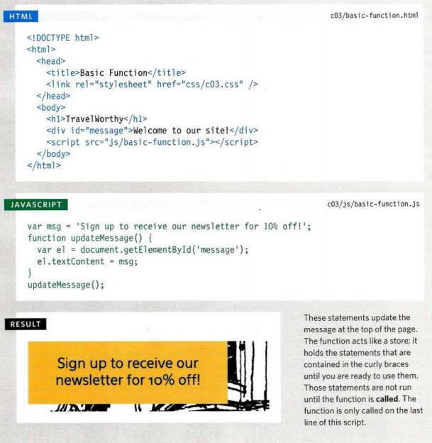

# **JAVA SCRIPT**
***
## **WHAT IS A JAVA SCRIPT ?** 
### It's a programming language that allows dynamic interactions with the browser, It tells the browser what it should do when certain things happen also it's very fast language .

## **"Interactive Front-End Web Development"**

***
***
## **HOW JAVA SCRIPT MAKES WEB PAGES MORE INTERACTIVE :**
1. ### **ACCESS CONTENT** :
    * Select the text inside all of the hl elements on a page .
    * Select any elements that have a class attribute with a value of note .
   * Find out what was entered into a text input whose id attribute has a value of emai1 .
2. ### **MODIFY CONTENT** :
   * Add a paragraph of text after the first hl element .
   * Change the value of c1ass attributes to trigger new CSS rules for those elements .
   * Change the size or position of an img element .
3. ### **PROGRAM RULES** :
   * A gallery script could check which image a user clicked on and display a larger version of that image.
   * A mortgage calculator could collect values from a form, perform a calculation, and display repayments. 
   * An animation could check the dimensions of the browser window and move an image to the bottom of the viewable area (also known as the viewport). 
4. ### **REACT TO EVENTS** :
   * A button is pressed .
   * A link is clicked (or tapped) on .
   * A cursor hovers over an element .
   * Information is added to a form .
   * An interval of time has passed .
   * A web page has finished loading .
   ***
   ***
## **"THE ABC OF PROGRAMMING"** :
### **A. What is a script and how do create one ?**
  * A script is a series of instructions that the computer can follow in order to achieve a goal. 
  * Each time the script runs, it might only use a subset of all the instructions.
  * Computers approach tasks in a different way than humans, so your instructions must let the computer solve the task prggrammatically.  
  * To approach writing a script, break down your goal into a series of tasks and then work out each step needed to complete that task (a flowchart can help). 

### **B. How do computers fit in with the world arround them ?** 
(we will talk about it later on)
### **C. How do I write a script for a web page ?** 
(we will talk about it later on)
***
***
***
***
## **"THE EXPRESSIONS"** :
### - **What are the expressions?**
**An expression evaluates into (results in) a single value Broadly speaking there are two types of expressions.**
### - **Types of expressions :**
1. EXPRESSIONS THAT JUST ASSIGN A VALUE TO A VARIABLE 
    * example: var color = 'beige'; 
2. EXPRESSIONS THAT USE TWO OR MORE VALUES TO RETURN A SINGLE VALUE
   * example: var area = 3 * 2; 
***
## **"THE OPERATORS"** :
### - **What are the operators?**
**Expressions rely on things called operators; they allow programmers to create a single value from one or more values.**
   ***
## **"ARITHMETIC OPERATORS"** 
**JavaScript contains the following mathematical operators, which you can use with numbers.** 

-**Example** :

***
## **"STRING OPERATOR"** :
**There is just one string operator: the+ symbol. It is used to join the strings on either side of it.**

-**Example** :

***
***
***
## **"THE FUNCTION"** :
### - **WHAT IS A FUNCTION?**
**Functions let you group a series of statements together to perform a specific task. If different parts of a script repeat the same task, you can reuse the function (rather than repeating the same set of statements).**

-**Basic Example** :

   

***
 * **DECLARING A FUNCTION :**

   

 * **CALLING A FUNCTION :**

   
 
 * **DECLARING  FUNCTIONS THAT NEED INFORMATION:**

    

 * **CALLING FUNCTIONS THAT NEED INFORMATION**

 * **GETTING A SINGLE VALUE OUT OF A FUNCTION**

    

***
***
***
[BACK TO MAIN PAGE](https://github.com/farahalwahaibi/Reading-Notes/blob/main/README.md)

